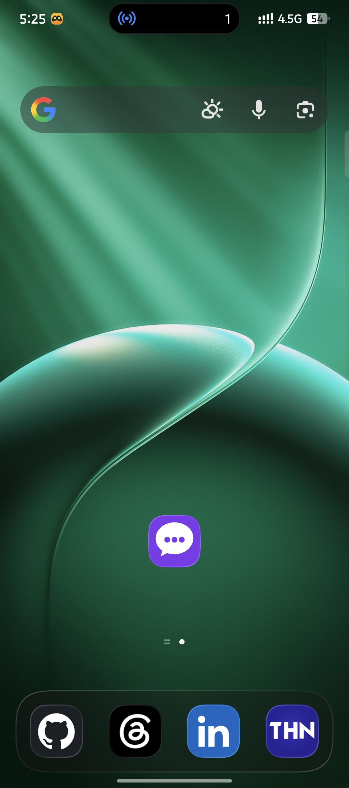
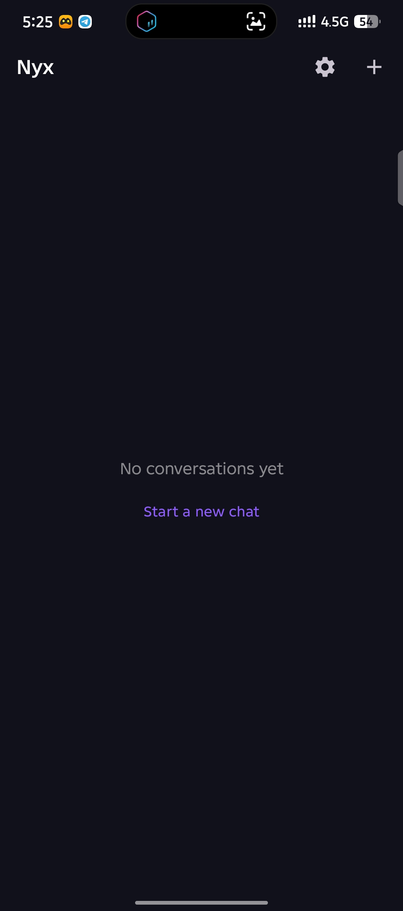
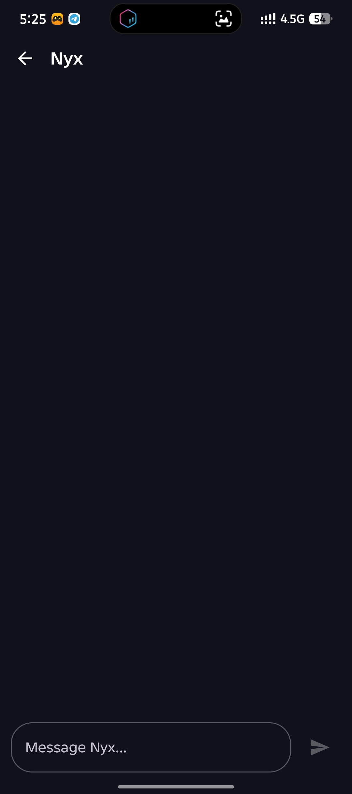
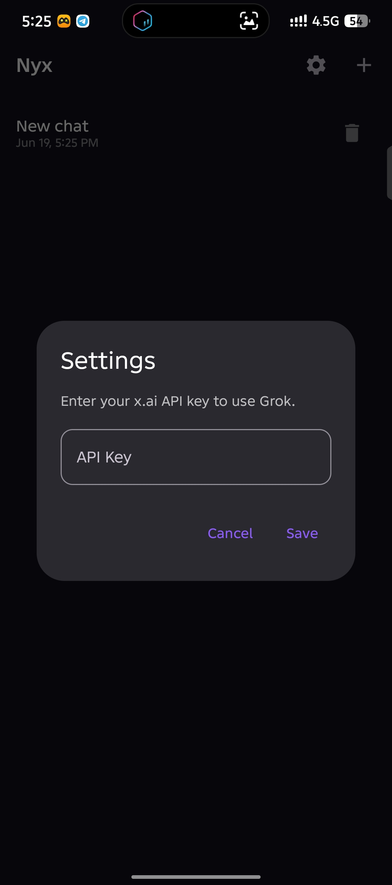
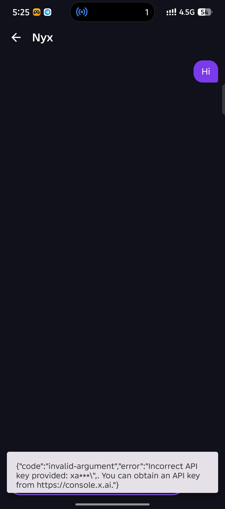

<picture>
  <source
    srcset="https://raw.githubusercontent.com/willygailo/nyx-chat/main/assets/banner-dark.png"
    media="(prefers-color-scheme: dark)"
  />
  
</picture>

<p align="center">
  
  
  
  
  
</p>

<p align="center">
  <b>Nyx</b> — a native Android conversation client for <a href="https://x.ai">x.ai Grok</a>, built with Kotlin &amp; Jetpack Compose.<br>
  Dark-themed, minimal, and designed for speed.
</p>

---

## ✨ Features

| | |
|---|---|
|  | Real‑time messaging with x.ai Grok (`grok-4`) via the OpenAI‑compatible API |
|  | Every conversation persisted in a local Room database |
|  | Create, switch, and delete multiple chat threads |
|  | Full Material 3 dark theme with purple accent palette |
|  | In‑app settings to set your own x.ai API key (securely stored) |
|  | Assistant responses rendered with Markwon (Markdown support) |

---

## 📸 Screenshots

<p align="center">
  
  
  
</p>
<p align="center">
  
  
</p>

---

## 🧱 Architecture

```
com.nyx.chat/
├── data/
│   ├── api/              # Retrofit API definitions & data classes
│   │   ├── ChatRequest.kt
│   │   ├── ChatResponse.kt
│   │   └── GrokApi.kt
│   ├── local/            # Room database, entities & DAOs
│   │   ├── AppDatabase.kt
│   │   ├── ConversationDao.kt
│   │   ├── ConversationEntity.kt
│   │   ├── MessageDao.kt
│   │   └── MessageEntity.kt
│   └── repository/       # Single source of truth
│       └── ChatRepository.kt
├── di/                   # Hilt modules
│   ├── AppModule.kt
│   └── NetworkModule.kt
├── ui/
│   ├── navigation/       # Jetpack Navigation graph
│   │   └── NavGraph.kt
│   ├── screens/
│   │   ├── chat/         # Chat screen & ViewModel
│   │   ├── conversationlist/  # Conversation list & ViewModel
│   │   └── settings/     # API key settings dialog
│   └── theme/            # Material 3 theme, colors, typography
├── MainActivity.kt       # Single activity, edge-to-edge
└── NyxApp.kt             # @HiltAndroidApp entry point
```

| Layer | Technology |
|---|---|
| **UI** | Jetpack Compose + Material 3 |
| **DI** | Dagger Hilt |
| **Persistence** | Room (SQLite) with Flow |
| **Networking** | Retrofit + OkHttp (with logging) |
| **API** | x.ai Grok (`grok-4`) — OpenAI compatible |
| **State** | ViewModel + StateFlow |

---

## 🚀 Getting Started

### Prerequisites

- Android Studio Ladybug (2024.3+) or newer
- JDK 17+
- Android SDK 35
- An [x.ai](https://x.ai) API key

### Clone & Build

```bash
git clone https://github.com/<your-username>/nyx-chat.git
cd nyx-chat

# Build debug APK
JAVA_HOME=/path/to/jdk-17 ./gradlew assembleDebug

# Install on connected device or emulator
adb install app/build/outputs/apk/debug/app-debug.apk
```

> **Note:** If you have the Android SDK installed at a non‑standard location, set `ANDROID_SDK_ROOT` before building.

### First Run

1. Open **Nyx** on your device
2. Tap the ⚙️ Settings icon in the top bar
3. Enter your x.ai API key
4. Tap **+** to start a new conversation
5. Type a message and hit **Send**

---

## 🛠 Tech Stack

| Dependency | Version | Why |
|---|---|---|
| [Kotlin](https://kotlinlang.org) | 2.1.0 | Modern, concise language |
| [Jetpack Compose](https://developer.android.com/jetpack/compose) | 2024.12.01 (BOM) | Declarative UI toolkit |
| [Material 3](https://m3.material.io) | — | Design system & dark theme |
| [Dagger Hilt](https://dagger.dev/hilt) | 2.53.1 | Dependency injection |
| [Room](https://developer.android.com/jetpack/androidx/releases/room) | 2.6.1 | SQLite ORM + Flow |
| [Retrofit](https://square.github.io/retrofit) | 2.11.0 | HTTP client for Grok API |
| [OkHttp](https://square.github.io/okhttp) | 4.12.0 | Networking + logging interceptor |
| [Navigation Compose](https://developer.android.com/jetpack/compose/navigation) | 2.8.5 | Screen routing |
| [Kotlin Serialization](https://kotlinlang.org/docs/serialization.html) | 1.7.3 | JSON parsing |
| [Markwon](https://github.com/noties/Markwon) | 4.6.2 | Markdown rendering |
| [Security Crypto](https://developer.android.com/jetpack/androidx/releases/security) | 1.1.0-alpha06 | Encrypted preferences |

---

## 🌙 Theme

The app uses a custom dark‑only Material 3 theme built around a deep purple accent:

```kotlin
// Color.kt
DarkSurface  = #1E1E2E
DarkBackground = #11111B
DarkCard     = #282840
UserBubble   = #7C3AED
BotBubble    = #2E2E4A
Accent       = #8B5CF6
```

---

## 🔐 API Key

The x.ai API key is stored locally in encrypted SharedPreferences (`nyx_prefs`). It is **never** logged, uploaded, or shared. You can change it at any time from the Settings dialog.

---

## 📦 APK Download

Debug builds are output to:

```
app/build/outputs/apk/debug/app-debug.apk
```

For a release build (signed with your own keystore):

```bash
./gradlew assembleRelease
```

---

## 🤝 Contributing

Pull requests are welcome! If you have ideas for:

- Streaming responses (SSE)
- Voice input
- Image recognition (Grok vision)
- Conversation search
- Light theme toggle

Open an issue or submit a PR.

---

## 📄 License

This project is licensed under the MIT License — see the [LICENSE](LICENSE) file for details.

---

<p align="center">
  Built with ❤️ and <a href="https://x.ai">x.ai Grok</a><br>
  <sub>Nyx — Greek goddess of the night. Because the best conversations happen after dark.</sub>
</p>
